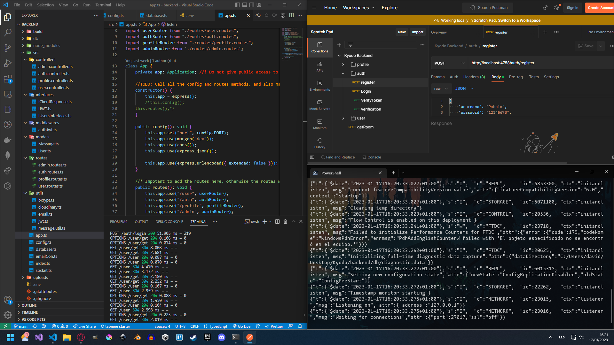

<div align="center">

  
  <h1>Kyodo's Backend</h1>
  
  <p>
    The official Kyodo backend you can host on your own system. 
  </p>
  
  
<!-- Badges -->
<p>
  <a href="https://github.com/Estiknok/KyodoBackend/graphs/contributors">
    
  </a>
  <a href="">
    
  </a>
  <a href="https://github.com/Estiknok/KyodoBackend/network/members">
    
  </a>
  <a href="https://github.com/Estiknok/KyodoBackend/stargazers">
    
  </a>
  <a href="https://github.com/Estiknok/KyodoBackend/issues/">
    
  </a>
  <a href="https://github.com/Estiknok/KyodoBackend/blob/main/LICENSE.md">
    
  </a>
</p>
   
<h4>
    <a href="https://github.com/Estiknok/KyodoBackend/issues/">Report Bug</a>
  <span> · </span>
    <a href="https://github.com/Estiknok/KyodoBackend/issues/">Request Feature</a>
  </h4>
</div>

<br />

<!-- Table of Contents -->
# :notebook_with_decorative_cover: Table of Contents

- [About the Project](#star2-about-the-project)
  * [Screenshots](#camera-screenshots)
  * [Tech Stack](#space_invader-tech-stack)
  * [Environment Variables](#key-environment-variables)
- [Getting Started](#toolbox-getting-started)
  * [Prerequisites](#bangbang-prerequisites)
  * [Installation](#gear-installation)
  * [Run Locally](#running-run-locally)
  * [Deployment](#triangular_flag_on_post-deployment)
- [Contributing](#wave-contributing)
- [License](#warning-license)

  

<!-- About the Project -->
## :star2: About the Project

Welcome to the kyodo backend, a crucial part of the Kyodo's app! Our backend is designed to provide a reliable and scalable infrastructure for your chat platform. We've built our backend with the latest technologies and industry best practices to ensure that you always have a fast and responsive chat experience, no matter how many users you have.

One of the key features of our backend is its flexibility and extensibility. We've designed our backend to be easily customizable, allowing you to add new features and functionality as your needs evolve. Additionally, our backend is designed to be self-hosted, giving you complete control over your data and allowing you to maintain the highest level of privacy and security.

It's important to mention that this backend is designed to work with the official kyodo frontend, however you can create your own frontend and use this backend if needed.

<!-- Screenshots -->
### :camera: Screenshots

<div align="center"> 
  
</div>


<!-- TechStack -->
### :space_invader: Tech Stack

<details>
  <summary>Server</summary>
  <ul>
    <li><a href="https://nodejs.org">NodeJS</a></li>
    <li><a href="https://www.typescriptlang.org/">Typescript</a></li>
    <li><a href="https://expressjs.com/">Express.js</a></li>
    <li><a href="https://socket.io/">SocketIO</a></li>
  </ul>
</details>

<details>
<summary>Database</summary>
  <ul>
    <li><a href="https://redis.io/">Redis</a></li>
    <li><a href="https://www.mongodb.com/">MongoDB</a></li>
  </ul>
</details>

<details>
<summary>DevOps</summary>
  <ul>
    <li><a href="https://www.docker.com/">Docker</a></li>
    <li><a href="https://cloudinary.com">Clodinary</a></li>
  </ul>
</details>
<details>
<summary>Deployment</summary>
  <ul>
    <li><a href="https://www.nginx.com">Nginx</a></li>
    <li><a href="https://pm2.keymetrics.io">Pm2</a></li>
  </ul>
</details>


<!-- Env Variables -->
### :key: Environment Variables

To run this project, you will need to have the following environment variables setted up

`CLOUD_NAME` : Stores the name of the cloud folder of Cloudinary

`CLOUD_API_KEY` : Stores the API key of Cloudinary

`CLOUD_API_SECRET` : Stores the API secret key to access Cloudinary

`DEFAULT_AVATAR_URL` : Stores the URL of a default avatar image

`PORT` : The port number on which the application runs and listens for incoming requests

`BCRYPT_SALT_NUM` : The number of salt rounds used in bcrypt password hashing to ensure secure password storage

`MONGO_HOST` : The hostname or IP address of the MongoDB server that the application connects to.

`MONGO_PASSWORD` : The password required to authenticate the application's connection to the MongoDB server

`MONGO_USER` : The username required to authenticate the application's connection to the MongoDB server

`MONGO_DATABASE` : The name of the MongoDB database that the application connects to

`MONGO_PORT` : The port number on which the MongoDB server is listening for incoming connections

`JWT_SECRET`: The secret key used to sign and verify JSON Web Tokens (JWTs) issued by the application

`JWT_DURATION` : The duration for which JWTs issued by the application will remain valid

`EMAIL_USER` : The email address that the application uses to send email verification links

`EMAIL_PASSWORD` : The password required to authenticate the application's connection to the email server

`EMAIL_PASSWORD_APP` : The password required by the application to use an email service provider's API to send email notifications

`ADMIN_PASSWORD` : The password for the administrator account in the application, used for administrative tasks and access to sensitive areas of the application (Not in use for now)

<!-- Getting Started -->
## 	:toolbox: Getting Started

<!-- Prerequisites -->
### :bangbang: Prerequisites

This project uses Nodejs and npm to manage all the necessary libraries

You will also need a MongoDB database

<!-- Installation -->
### :gear: Installation

To install the project simply clone this respository

```bash
  git clone https://github.com/Estiknok/KyodoBackend.git
  cd KyodoBackend
```

Now only excecute the following commands on a terminal inside the project to install the dependencies and setup the project

```bash
  npm i
  npm run build
```

<!-- Run Locally -->
### :running: Run Locally

To run the project locally simply excecute the following command on a terminal inside the project to start the server

```bash
  npm run start
```


<!-- Deployment -->
### :triangular_flag_on_post: Deployment

To deploy this project to a linux sever simply follow these steps. It's importanto to say that theese steps apply to debian linux distros, however it's a global deployment method
so you can adapt the commands shown and it will work perfectly.

It's also important to mention that there is a script called `deploy.sh` in the project files which does this whole process automaticaly, but it's not finished yet. So use it
on your own risk.

1. First update the respositories

```bash
  sudo apt update
```

:bangbang: You will need to have installed nvm for you to install nodejs more easily, so go to their github page [here](https://github.com/nvm-sh/nvm) and follow the steps install it.

2. Now simply run these commands to install the latest version of Nodejs

```bash
  nvm install node
```

3. The following command will install Pm2, which is needed for the deployment

```bash
  npm install pm2 -g
```

4. Nginx is also necessary, so lets install it

```bash
  sudo apt install -y nginx
```

5. Now simply get in the folder and install the dependencies and build the project

```bash
  npm i
  npm run build
```

6. This command will start the server using pm2

```bash
  pm2 start build/index.js --name kyodo-backend
```

7. Configure Nginx to reverse proxy requests to your Node.js application

```bash
  sudo apt install nginx
  sudo nano /etc/nginx/sites-available/default
```

8. Add the following configuration to the Nginx default site file

```bash
  server {
    listen 80;
    server_name _;

    location / {
        proxy_pass http://localhost:4758;
        proxy_http_version 1.1;
        proxy_set_header Upgrade $http_upgrade;
        proxy_set_header Connection 'upgrade';
        proxy_set_header Host $host;
        proxy_cache_bypass $http_upgrade;
    }
  }
```

9. Verify the Nginx configuration syntax and restart the Nginx service

```bash
  sudo nginx -t
  sudo systemctl restart nginx
```

10. Configure PM2 to automatically start your application on server boot

```bash
  pm2 startup systemd
  pm2 save
```

That's it! Now the server is up and running perfectly.

<!-- Contributing -->
## :wave: Contributing

<a href="https://github.com/Estiknok/KyodoBackend/graphs/contributors">
  
</a>


Contributions are always welcome!

See `contributing.md` for ways to get started.

<!-- License -->
## :warning: License

Distributed under the MIT license. See `LICENSE.md` for more information.


[license-shield]: https://img.shields.io/github/license/othneildrew/Best-README-Template.svg?style=for-the-badge
[license-url]: https://github.com/othneildrew/Best-README-Template/blob/master/LICENSE.txt
